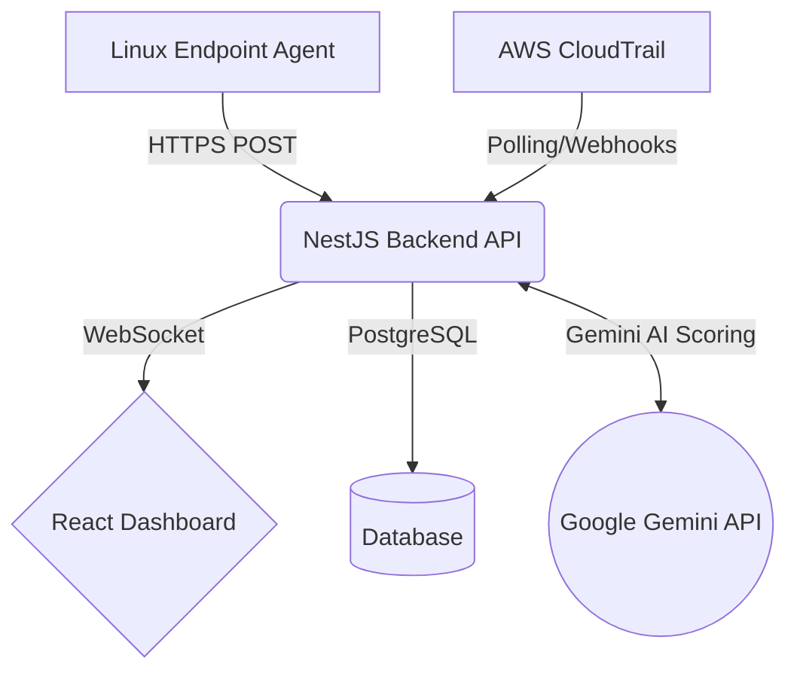

# 🛡️ SentinelX: Multi-Cloud & Endpoint Security SaaS

<!--  -->

**SentinelX** is an AI-powered, multi-tenant security monitoring platform designed to provide unified threat detection, rapid incident response, and compliance auditing across both cloud infrastructure (AWS/GCP/Azure) and Linux endpoints.

Built as a highly scalable microservice architecture, SentinelX leverages the **Gemini AI API** to intelligently analyze incoming security events and filter out noise, providing security teams with actionable, high-confidence alerts.

---

## 🚀 Key Features

*   **🧠 AI-Powered Threat Detection:** Integrates directly with the Gemini 2.5 Flash API to analyze complex attack vectors (like Ransomware behavior or multi-stage privilege escalation) in real-time.
*   **☁️ Cloud Native Auditing:** Deep integration with **AWS CloudTrail** to detect:
    *   S3 Bucket modifications (Ransomware/Data Exfiltration)
    *   IAM Privilege Escalation
    *   Suspicious Logins and Reconnaissance Activity
    *   Security Group / Firewall downgrades
*   **🖥️ Endpoint Monitoring (Agent):** A lightweight Python agent deployed to your Linux hosts that actively monitors:
    *   File Integrity (FIM)
    *   Process Execution Anomalies
    *   Unauthorized Network Bindings
    *   Suspicious User Activity (SSH)
*   **🏢 Multi-Tenant Architecture:** Securely manages multiple organizations, isolating users, agents, and alerts.
*   **⚡ Real-Time Dashboard:** A gorgeous, dark-mode React UI powered by WebSockets for sub-second alert streaming.
*   **⚙️ Persistent Cloud Settings:** Securely stores AWS integration keys and email preferences in PostgreSQL.
*   **🔄 Background Polling Daemon:** Continuously syncs AWS logs every 3 minutes for automated threat detection without manual intervention.
*   **📧 Intelligent Email Alerting:** Integrates with Resend to instantly dispatch email notifications for high/critical incidents and user invitations.
*   **📈 Real-time AI Analytics:** Dashboard displaying dynamic 7-day average AI confidence scores and behavioral risk deviations based on actual historical database logs.

---

## 🏗️ Architecture & Data Flow

SentinelX is broken down into four core components:

1.  **Frontend (React + Vite + TailwindCSS):** The security operations center (SOC) dashboard.
2.  **Backend (NestJS + PostgreSQL):** The core routing, correlation, and API gateway.
3.  **Endpoint Agent (Python + psutil):** The lightweight daemon installed on target machines.
4.  **Detection Engine (Python + FastAPI):** An expandable ML sandbox for future custom trained models.



### 🎯 How Detection Rules Work
SentinelX empowers users to create custom **Detection Rules** directly from the frontend dashboard. 
1. **Creation**: A SOC analyst navigates to the *Rules* page and creates a rule (e.g., `Regex Match`).
2. **Usage**: These rules are evaluated by the backend `DetectionService`. Whenever an event is ingested, the engine iterates through active rules for that Organization.
3. **Action**: If an event matches a rule's configuration, an Alert is generated.

**Example Rule:**
*   **Name:** "Detect Nmap Scans"
*   **Type:** Regex
*   **Configuration:** `pattern: "nmap.*"`
*   **Result:** Any process execution event containing "nmap" immediately triggers a security alert.

### 🔗 Event Correlation & Incident Management
Security alerts can quickly become overwhelming. To solve "alert fatigue," SentinelX utilizes a **Correlation Engine** (`correlation.service.ts`).
1. When a new Alert is triggered (either by Gemini AI or a Custom Rule), it passes through the `CorrelationService`.
2. The service looks for existing, open **Incidents** within that Organization's scope.
3. Instead of bombarding the dashboard with 50 separate alerts for a single attack, it **correlates related alerts into a single, unified Incident ticket**, allowing security teams to manage the overarching attack rather than individual logs.

---

## 🛠️ Setup Instructions

There are two ways to run SentinelX: using Docker Compose (Recommended) or running it manually.

### Option A: Running with Docker (Recommended)
This is the fastest way to get the entire microservice stack running.

1. Ensure Docker and Docker Compose are installed on your machine.
2. **Environment Variables:** Create a `.env` file in the root directory (where `docker-compose.yml` is located) with the following variables. This ensures your Docker containers receive the correct database passwords and API keys:
   ```env
   # Database Configuration
   DB_NAME=sentinelx
   DB_USER=sentinelx
   DB_PASSWORD=your_secure_password
   DB_PORT=5432

   # Backend Configuration
   PORT=3000
   NODE_ENV=development
   JWT_SECRET=super-secret-jwt-key
   JWT_EXPIRATION=24h
   GEMINI_API_KEY=your_gemini_api_key_here
   
   # Frontend Configuration
   VITE_API_URL=http://localhost:3000
   VITE_WS_URL=ws://localhost:3000
   ```
3. Start the entire platform with one command:
```bash
docker compose up -d
```
*Docker will automatically read the `.env` file, build the images, start PostgreSQL, the Node.js backend, and the React frontend.*

> [!WARNING]
> **Database Password Mismatch:** If you change the `DB_PASSWORD` in your `.env` file *after* you have already run `docker compose up` once, you will get a `password authentication failed for user "postgres"` error in your backend logs. 
> To fix this, you must delete the old database volume so PostgreSQL can re-initialize with the new password:
> `docker compose down -v && docker compose up -d`

### Option B: Manual Setup (No Docker)
If you prefer running the services directly on your host machine:

#### Prerequisites
*   Node.js 18+
*   Python 3.9+
*   PostgreSQL 15+

#### 1. Database Setup
Ensure PostgreSQL is running locally. You must create the database, create the user, and set the user password to exactly match what is in your `.env` file.
```bash
sudo -u postgres psql -c "CREATE USER sentinelx WITH PASSWORD 'sentinelx';"
sudo -u postgres psql -c "CREATE DATABASE sentinelx OWNER sentinelx;"
sudo -u postgres psql -c "GRANT ALL PRIVILEGES ON DATABASE sentinelx TO sentinelx;"
```

#### 2. Environment Variables
Ensure the following `.env` files exist with the correct configurations:
*   `backend/.env`: Must contain `DB_PASSWORD=your_secure_password` and `GEMINI_API_KEY=your_key`.
*   `frontend/.env`: Must point `VITE_API_URL` to the backend.
*   `agent/.env`: Used for the endpoint monitor.

#### 3. Start Backend & Frontend
```bash
# Terminal 1: Backend
cd backend
npm install
npm run start:dev

# Terminal 2: Frontend
cd frontend
npm install
npm run dev
```

### 4. Deploying the Linux Agent
To monitor a Linux endpoint, install the Python agent. The dashboard provides dynamic deployment commands, but the manual process is:

```bash
cd agent
python3 -m venv venv
source venv/bin/activate
pip install -r requirements.txt

# Export your organization token (found in your Dashboard settings)
export SENTINELX_TOKEN="your-jwt-token"
export SENTINELX_API_URL="http://localhost:3000"

# Run the agent
python -m sentinelx_agent.main
```

---

## 🛡️ Cloud Threat Detection Rules

SentinelX automatically categorizes AWS CloudTrail events into severities. High/Critical events are passed to Gemini AI for final confirmation.

*   **Critical Severity:** `DeleteBucket`, `PutBucketPolicy`, `PutBucketPublicAccessBlock`, `CreateUser`, `StopLogging`, `DeleteTrail`
*   **High Severity:** `ConsoleLogin`, `AssumeRole`, `AuthorizeSecurityGroupIngress`, `RunInstances`
*   **Medium/Info Severity:** `DescribeInstances`, `ListBuckets`, routine API calls.

## 🤝 Contributing
This project was developed as a comprehensive Cloud Computing Major Project. Contributions, bug reports, and feature requests are welcome!

## 📄 License
MIT License
