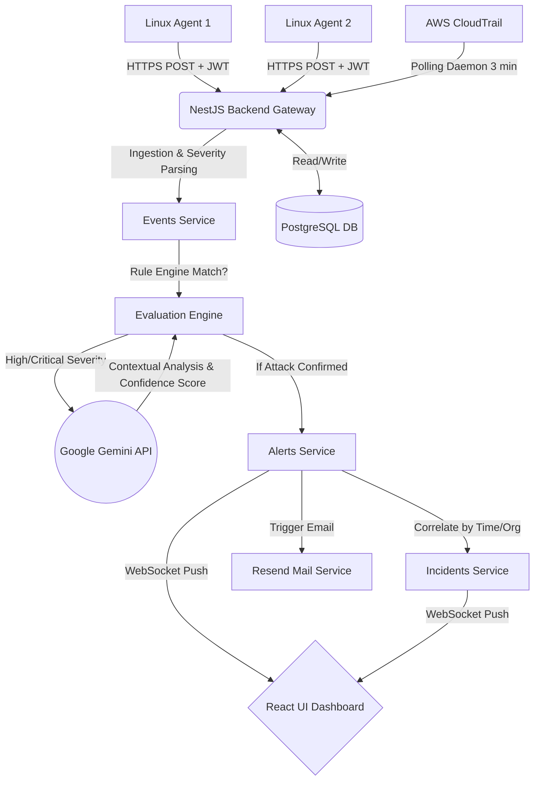

# SentinelX: Unified Multi-Cloud & Endpoint Security SaaS
## Comprehensive Project Report & Presentation Material

---

## 1. Executive Summary

As organizations rapidly migrate to cloud-native architectures, their infrastructure becomes increasingly decentralized. A modern company might host its databases on AWS, its web applications on Google Cloud (GCP), and its legacy workloads on Linux Virtual Machines. **SentinelX** is an AI-powered, multi-tenant security monitoring platform engineered to address the critical vulnerabilities inherent in this decentralized model.

SentinelX provides unified threat detection, rapid incident response, and compliance auditing across both cloud infrastructure (via APIs) and Linux endpoints (via lightweight agents). By heavily leveraging the **Google Gemini 2.5 Flash AI API**, SentinelX acts as an automated "Level 1 Security Analyst," filtering out benign anomalies and escalating high-confidence, contextualized cyber threats to human security teams in real-time.

---

## 2. The Problem Statement (In-Depth)

The cybersecurity landscape is fundamentally broken for small-to-medium enterprises (SMEs) and even large security operations centers (SOCs) due to the following critical issues:

1. **Alert Fatigue:** Security tools are inherently "noisy." They generate thousands of low-level alerts daily. An analyst cannot manually review every failed SSH login, minor network anomaly, or routine AWS API call. Consequently, true, critical attacks are often buried under a mountain of false positives, leading to missed breaches.
2. **Fragmented Visibility (The Multi-Cloud Blind Spot):** AWS logs live in CloudTrail. Linux OS logs live in `/var/log`. Identifying a coordinated attack—where a hacker compromises a Linux web server, steals an IAM role, and *then* uses it to exfiltrate AWS S3 data—requires manually piecing together logs from totally disjointed systems. 
3. **The Limitation of Static Rules:** Current systems rely on static threshold rules (e.g., "Alert if > 5 failed logins occur in 1 minute"). Hackers easily bypass these static rules by slowing down their attacks or distributed their payload. There is a desperate need for dynamic, contextual, AI-driven analysis.
4. **Prohibitive Cost & Complexity:** Traditional Security Information and Event Management (SIEM) tools like Splunk or Datadog are astronomically expensive. Their pricing models are based on data ingestion volume (per GB), punishing companies for logging more security data. Furthermore, they require highly specialized engineers to write complex queries.

---

## 3. Existing Solutions & Gap Analysis

Several industry tools attempt to solve these problems, but they come with significant drawbacks that SentinelX aims to resolve:

| Solution | Strengths | Weaknesses |
| :--- | :--- | :--- |
| **Splunk Enterprise** | Industry standard SIEM, extremely powerful log aggregation. | Exorbitantly expensive. Requires mastery of SPL (Splunk Processing Language). |
| **AWS GuardDuty** | Excellent, out-of-the-box monitoring for AWS environments. | Vendor lock-in. Completely blind to GCP, Azure, and deep Linux endpoint process-level execution. |
| **Wazuh** | Great open-source endpoint detection tool. | Outdated user interface. Requires heavy on-premise infrastructure to host. Lacks native Generative AI integration for automated triaging. |
| **CrowdStrike** | World-class endpoint protection (EDR). | Very expensive. Heavily focused on the endpoint rather than overarching multi-cloud API abuse. |

---

## 4. Our Solution: SentinelX

**SentinelX** bridges the gap between Endpoint Detection and Response (EDR) and Cloud Security Posture Management (CSPM), unifying them under an AI-first architecture.

### Key Value Propositions:
* **The Unified Dashboard:** Brings AWS CloudTrail events and Linux endpoint logs into a single, beautiful, real-time React dashboard.
* **Generative AI as a SOC Analyst:** SentinelX does not rely solely on static rules. It feeds high-severity logs directly to Google's Gemini 2.5 Flash AI. The AI analyzes the context of the event, reads the JSON payload, and determines if it is a true attack or a benign misconfiguration.
* **Automated Correlation:** SentinelX intelligently groups related, isolated alerts into a unified **Incident**. Instead of investigating 50 disjointed alerts, the security analyst investigates 1 cohesive Incident timeline.
* **Frictionless Deployment:** Agentless integration for Cloud APIs, paired with a heavily optimized, lightweight Python agent for deep Linux server monitoring.

---

## 5. Detailed Architecture & Tech Stack

SentinelX is built on a highly scalable, decoupled microservice architecture.

### 5.1. Tech Stack Overview
*   **Frontend UI:** React 18, Vite, TailwindCSS (for modern, responsive dark-mode styling), Zustand (State Management).
*   **Backend API:** NestJS (TypeScript enterprise framework), TypeORM (Database Object-Relational Mapper).
*   **Real-Time Engine:** WebSockets (`socket.io`) for sub-second log and alert streaming directly to the browser.
*   **Database:** PostgreSQL 15 (Relational data storage for tenants, rules, and incidents).
*   **AI Engine:** Google Gemini API (`@google/genai`).
*   **Endpoint Agent:** Python 3, utilizing `psutil` and native OS hooks.
*   **Notification Engine:** Resend API for HTML email dispatches.

### 5.2. Architecture Diagram & Data Flow



---

## 6. The AI Engine (Gemini 2.5 Flash Integration)

The crown jewel of SentinelX is its integration with Google's Gemini AI. 

### How the Integration Works:
1. When a new log arrives, the backend assigns a base severity (e.g., executing a command in bash is `info`, but deleting an S3 bucket is `critical`).
2. Any event marked `high` or `critical` pauses the pipeline and generates a prompt for Gemini.
3. **The Prompt Construction:**
   ```text
   Analyze the following cybersecurity event and determine if it represents a malicious attack or a severe security misconfiguration.
   Event Title: {event.title}
   Event Description: {event.description}
   Event Source: {event.source}
   Raw Data: {JSON.stringify(event.raw_data)}

   Respond ONLY with a valid JSON object in this format:
   {
     "isMalicious": boolean,
     "confidence": number (0-100),
     "reasoning": "A concise, 1-sentence explanation of why it is or is not an attack."
   }
   ```
4. **Actionable Results:** The NestJS backend parses the JSON response. If `isMalicious` is true and the `confidence` score is above 70%, SentinelX immediately elevates this to an active Alert, eliminating human guesswork.

---

## 7. Cloud Ingestion (AWS CloudTrail Integration)

Cloud environments are notorious for "Shadow IT" (unauthorized resource creation) and IAM privilege escalation. SentinelX combats this natively.

### The Background Polling Daemon
SentinelX does not require complex webhook setups on the AWS side. Instead, it utilizes a background polling daemon via `@nestjs/schedule` (or `node-cron`/`setInterval` equivalents).
*   **Process:** Every 3 minutes, the NestJS `CloudIntegrationsService` iterates through all organizations in the PostgreSQL database that have persistent AWS keys saved.
*   **Extraction:** It securely queries the `AWS.CloudTrail` API for the last 15 minutes of events.
*   **Severity Mapping:** The backend dynamically maps massive JSON logs into readable severities. For example:
    *   `DeleteBucket`, `PutBucketPublicAccessBlock`, `DeleteTrail` → **CRITICAL**
    *   `AssumeRole`, `ConsoleLogin`, `AuthorizeSecurityGroupIngress` → **HIGH**
    *   `DescribeInstances`, `ListBuckets` → **MEDIUM / INFO**

---

## 8. Linux Endpoint Agent (Deep Dive)

Cloud logs only capture API interactions. If a hacker exploits a vulnerability in an Apache web server running on an EC2 instance, CloudTrail will be completely blind to it. This is why SentinelX includes a native Endpoint Agent.

### Technical Design:
*   **Language:** Python 3 (chosen for universal Linux compatibility and lightweight memory management).
*   **Security:** Communicates with the NestJS API exclusively over HTTPS using a strict, cryptographically signed JSON Web Token (JWT) linked to the specific Organization ID.

### Monitoring Modules:
1.  **File Integrity Monitoring (FIM):** Continuously calculates SHA-256 hashes of critical system files (e.g., `/etc/passwd`, `/etc/shadow`, `/root/.ssh/authorized_keys`). If a file is altered, an event is triggered.
2.  **Process Anomaly Detection:** Scans running system processes using `psutil`. It cross-references running processes against a blacklist (e.g., `xmrig` for crypto-mining, `nmap` for network scanning, `netcat` for reverse shells).
3.  **Authentication Logs:** Parses `/var/log/auth.log` or `/var/log/secure` to detect brute-force SSH attacks or unauthorized `sudo` escalations.

---

## 9. Event Correlation & Incident Management

Security alerts can quickly become overwhelming. If a hacker runs a script that touches 50 files, a traditional system will send 50 emails. SentinelX solves "alert fatigue" through its **Correlation Engine**.

1. When a new Alert is triggered (either by Gemini AI or a Custom Rule), it passes through the `CorrelationService`.
2. The service looks for existing, open **Incidents** within that Organization's scope that occurred within a similar timeframe (e.g., the last 4 hours).
3. Instead of bombarding the dashboard, it correlates related alerts into a single, unified Incident ticket.
4. Security teams can update the status of the Incident (`Open` → `Investigating` → `Resolved`), providing a proper lifecycle for incident response.

---

## 10. Notification & Alerting Infrastructure

SentinelX ensures that critical threats are never missed, even when analysts are away from the dashboard.

*   **Resend API Integration:** SentinelX uses the modern Resend API to deliver beautifully formatted, HTML-rich emails.
*   **Conditional Triggering:** Emails are strictly reserved for `High` or `Critical` severity alerts to prevent inbox spam.
*   **Custom Preferences:** Organizations can toggle email alerts on/off and specify a dedicated `Alert Email Address` (like `soc-team@company.com`) directly from the SentinelX Settings dashboard. These preferences are permanently saved in PostgreSQL.

---

## 11. Real-Time Analytics Dashboard

The platform provides a dynamic `/analytics` dashboard that relies on real historical data, updated dynamically as new logs enter the system.

*   **AI Confidence Trends:** A dynamic 7-day trailing graph that calculates the true average confidence scores of AI-detected attacks based on the historical logs stored in PostgreSQL.
*   **Behavioral Risk Deviations:** Progress bars that calculate the volume of high-severity events to dynamically warn the user about increasing "Data Exfiltration Risks" or "Privilege Escalation Risks" before a total breach occurs.

---

## 12. Database Design & Entity Relationships

The PostgreSQL schema is fully normalized and strictly enforces multi-tenancy.

*   **Organization (`organizations`):** The root tenant. Stores persistent settings (AWS Access Keys, Email configurations).
*   **User (`users`):** Contains `email`, `password_hash`, and is linked via Foreign Key to an `Organization`.
*   **Event (`events`):** The raw log data (CloudTrail or Agent logs). Linked to an `Organization`.
*   **Alert (`alerts`):** A materialized threat (generated by rules or AI). Linked to an `Organization` and optionally an `Incident`.
*   **Incident (`incidents`):** A correlated container of multiple alerts.

---

## 13. Future Scope & Roadmap

While the MVP of SentinelX is highly functional and production-ready, the roadmap for enterprise scaling includes:

1. **Automated Remediation:** Transitioning from "Detection" to "Response." Automatically instructing the Linux agent to kill a malicious process, or utilizing the AWS SDK to automatically revoke a compromised IAM user token.
2. **Machine Learning Baselining:** Implementing localized, unsupervised ML models to learn the "normal" behavior of a specific server over 30 days (e.g., what times do users usually log in?). Any deviation from the baseline would trigger an alert without needing static rules.
3. **Kubernetes Support:** Expanding the Python agent to run as a DaemonSet in Kubernetes clusters to monitor pod-to-pod network traffic and container escapes.
4. **Threat Intelligence Feeds:** Integrating with external databases (like VirusTotal or AlienVault OTX) to automatically cross-reference IP addresses found in logs against known malicious command-and-control (C2) servers.

---

## Conclusion

SentinelX democratizes enterprise-grade security. By combining lightweight endpoint agents, intelligent background cloud polling, and cutting-edge generative AI, it strips away the complexity and exorbitant costs of traditional SIEMs. It empowers lean engineering teams to detect, understand, and respond to cyber threats in real-time, providing true peace of mind in a complex multi-cloud world.
